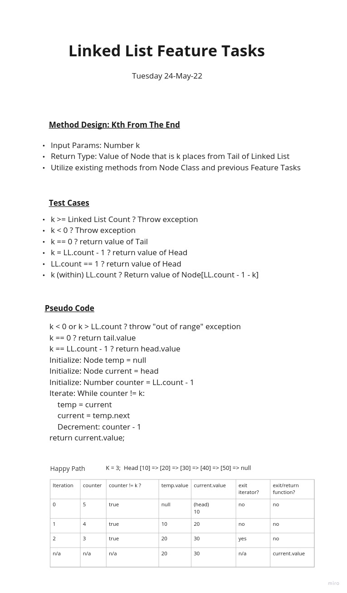

# Data Structures

## Description

Develop data structures and algorithms using:

- OOP concepts
- References
- Gradle
- JUnit Jupiter
- And of course, Java

## List of Projects

[Binary Tree and BST Implementation](./res/trees/README-trees.md)

[Append, Insert Before, Insert After](./res/Append-InsertB4-InsertAfter.jpg)

[array-binary-search](./res/array-binary-search/readme.md)

[array-insert-shift](./res/arr-insert-shift/array-insert-shift.md)

[array-reverse](./res/array-reverse/README.md)

[balanced-brackets](./res/stack-and-queue/BalancedBracketsREADME.md)

[pseaudo-queue](./res/stack-and-queue/PseudoQueueREADME.md)

[stacks-and-queues](./res/stacks-and-queues-README.md)

[linked-list-kth](./res/linked-list-kth.jpg)

-- -

## Linked Lists

### Linked Lists Challenge

Create a Linked List Node Class.
Create a Linked List Class.
Update Methods to enable functionality like:

1. Includes
2. Inserts
3. ToString
4. Append
5. InsertBefore (Node with value)
6. InsertAfter (Node with value)
7. Return Kth from end Node's value

### LL Requirements

Create a Node Class:

- Property for the value stored in the Node.
- Property pointing to the 'next' node.

Create a Linked List Class:

- Include a HEAD property.
- Include a custom (default) Constructor should create an empty Linked List when instantiated.
- Method: INSERT => args 'value', returns void, adds new Node with that value to the 'head' of the list with an O(1) Time performance.
- Method: INCLUDES => args 'value', returns Boolean, indicates whether the value exists as a Node's value somewhere within the list.
- Method: TOSTRING => Override, no args, returns String representing all the values in the Linked List.
- Method: APPEND => args 'new value', adds new node with given value to end of the Linked List.
- Method: INSERTBEFORE => args 'value, new value', adds new node with given value prior to first Node found with specified value.
- Method: INSERTAFTER => args 'value, new value', adds new Node with given value immediately following the first Node found with specified value.
- Method: getKthNodeFromEndValue => args 'index', finds Node that is 'index' from Tail Node and returns that Node's value.

Create Unit Tests:

- At least 1 unit test for all Feature functions => Presumably the 'happy path' test. :)
- Additional tests as defined in instructions.
- Additional tests for edge-cases etc per domain diagramming and technical whiteboard planning session.

#### LL ToString Override

Returns `[a]->[b]->[c]->NULL` where a, b, and c are NODEs.

### LL Approach and Efficiency

My approach was to avoid loops whenever possible, however searching required an iterative approach.

Linked List Class:

Constructor => Time: O(1) Space: O(1) => Sets up Properties in single call

Insert => Time: O(1) Space: O(1) => Single new object; Utilized HEAD reference and re-links Nodes without iterating

Includes => Time: O(n) Space: O(1) => No additional methods or object utilized

Append => Time: O(1) Space O(1) => Single new object; No loops just REF to TAIL with REF replacement

InsertBefore => Time: O(n) Space: O(1) => Single while loop, single added object, other REFs are shallow pointers

InsertAfter => Time: O(n) Space: O(1) => Single while loop, single added object, other REFs are shallow pointers

ToString => Time: O(1) Space: O(1) => Avoids using immutable String type

GetKthNode... => Time: O(n) Space: O(1) => Single while loop only runs in worse-case scenarios otherwise quickly exits; REFs to existing nodes used and only 1 new Node is instantiated

### LL API

Description of each method publicly available to the Linked List:

- Constructor: Custom empty constructor sets Head, Tail to null.
- Insert: Accepts an Integer value, creates a new Node with that value, inserts to head of list, and returns void.
- Includes: Accepts an Integer value and returns True if at least 1 Node with same value found in LL, otherwise False.
- Append: Accepts an Integer value, creates a new Node with that value, then appends it to the end of the linked list.
- InsertBefore: Accepts an Integer value to create a new node and a search Integer value. Inserts New Node ahead of existing Node with same value as Integer arg.
- InsertAfter: Accepts an Integer value to create a new node and a search Integer value. Inserts New Node behind existing Node with same value as Integer arg.
- ToString: See ToString Override (above). Returns all node values in Head-to-Tail order.

### LL Design Whiteboards

-- -

## Footer

Link to [this challenge code files](../datastructures/lib/src/main/)

Return to Data Structures and Algorithms root [Readme.md](../../README.md)
