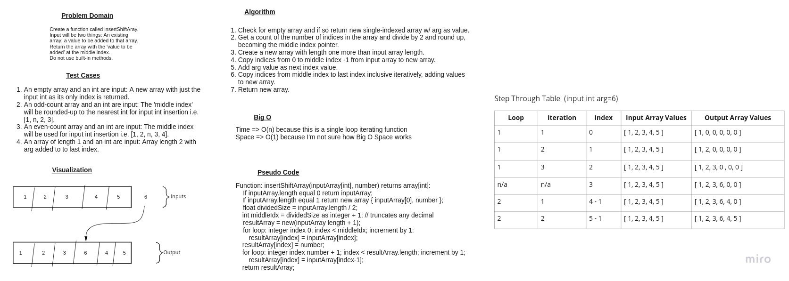

# Array Insert and Shift

A *whiteboard only* Code Challenge assignment.

## Whiteboard Process

## Approach and Efficiency

Describe my approach.
Elaborate on why that approach was taken.
Discuss the Big O space/time for this approach.

## Goal

Whiteboard a function called insertShiftArray that takes an array and a value to be added.
Return an array with the new value added at the middle index.

## Restrictions

Do not use built-in methods available in Java.

## Example Inputs and Outputs

`[2, 4, 5, -8], 5` => `[2, 4, 5, 6, -8]`
`[42, 8, 15, 23, 42], 16` => `[42, 8, 15 ,16 ,23 ,42]`

## Stretch Goal

Whiteboard a second function that removes an element from the middle index and shifts other elements in the array to fill the new gap.

## Footer

Back to room [Readme.md]
