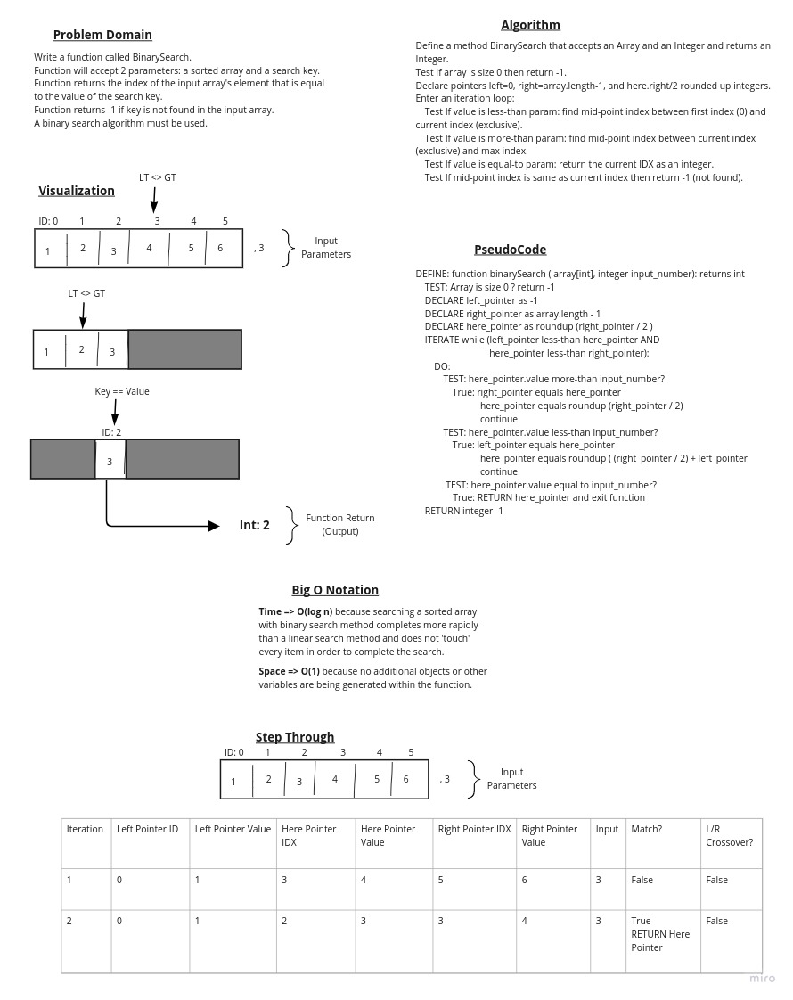

# Binary Search of Sorted Array

## Goals

This challenge will require building a whiteboard to solve the problem.

### Requirements

Write a function called BinarySearch.

Function will take 2 parameters: An array (sorted) and a search "key".

Function will return the index of the input array's element that is equal to the value of the search key.

If the function cannot locate an equal value it will return integer -1.

Utilize a 'binary search' algorithm to solve this problem.

#### Restrictions

Do not use any Java built-in methods to solve this challenge.

### Whiteboard Process

### Approach and Efficiency

#### My Approach (and why):

In order to "but the problem in half at every step" (binary thinking) it was necessary to track what segment of the array to pay attention to.

Since the array is *sorted*, a simple test of the middle (or nearest middle) index value against the number parameter could inform the algorithm whether to "search left" (smaller values) or "search right" (larger values).

At that point the algorithm can find the middle index again (or nearst middle) and repeat itself -- using an iterating construct.

Since a positive match or -1 outputs are desired, a test for the positive match that is 'true' immediately returns the current index integer and exits the function.

Likewise, when the left-hand and right-hand bounding pointers overlap with the "middle" index (or each other) then the function should exit, returning a -1 because it did not find a matching value.

#### Describe the BigOs of this approach:

*Space*: O(1) => The algorithm does not continually add any variables, or other arrays or objects during its execution, and the input array is not manipulated in any way (only interrogated), the total memory consumption is relatively static.

*Time*: O(log n) => Since the algorithm cuts the problem in half every time it tests for a match, it can find a match (or determine a match does not exist) *without touching every single index* in the input array, in a worst-case scenario.
Therefore, the time to execute this algorithm in a worst-case scenario would be logrithmically faster than using a linear searching approach.

## Footer

Back to [Read Me](../../README.md)
