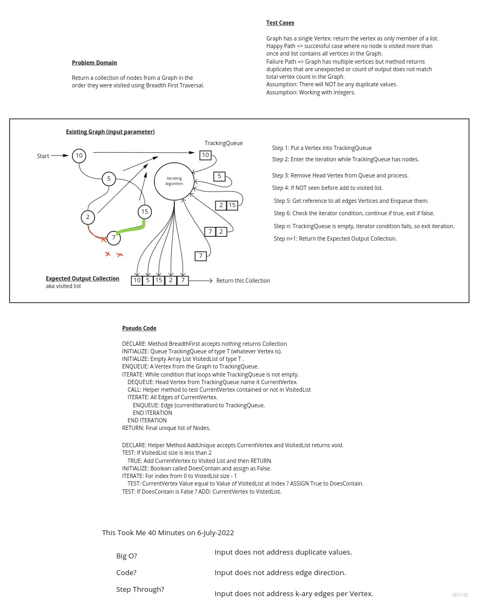

# Breadth Traverse a Graphs

## Challenge

Return a collection of nodes from a Graph in the order they were visited using Breadth First Traversal.

## Features

- [X] Implement breadthFirst method.
- [X] Method takes no arguments.
- [X] Method returns a Collection of visited Nodes (Vertices).
- [X] Implement solution using "clean, reusable, abstract component parts".
- [X] Write at least 3 test cases (unittests) for each method created.
- [ ] Ensure tests are passing (Two unittests not pass until I implement UNDIRECTED edges (Graph is currently DIRECTED)).
- [X] Plan implementation by drawing a whiteboard to model and analyze the problem domain prior to implementation.

## Whiteboard

## Structure and Testing

Utilize the Single-responsibility principle: any methods you write should be clean, reusable, abstract component parts to the whole challenge. You will be given feedback and marked down if you attempt to define a large, complex algorithm in one function definition.

Be sure to follow your language/frameworks standard naming conventions (e.g. C# uses PascalCasing for all method and class names).

Any exceptions or errors that come from your code should be contextual, descriptive, capture-able errors. For example, rather than a default error thrown by your language, your code should raise/throw a custom error that describes what went wrong in calling the methods you wrote for this lab.

Tests:

- [ ] BreadthFirst method does not return duplicate nodes.
- [ ] BreadthFirst method nodes are not visited more than once.
- [ ] BreadthFirst does not retrace over cyclical Graph edges.
- [X] Graph has single vertex returns collection of one.
- [X] Unique Helper Method accepts Null Vertex input without throwing.
- [X] Unique Helper Method does not add same-value inputs to the Collection.
- [X] Unique Helper Method returns only unique values.

## Approach & Efficiency
<!-- What approach did you take? Why? What is the Big O space/time for this approach? -->

Created a helper method to ensure only unique values are included in the "visited" collection, which will help ensure
a cyclic Graph does not result in a forever-loop condition.

Re-wrote the Breadth First implmementation based solely off of a whiteboarding session, not copying the existing
breadthfirst method that takes arguments (unlike this one).

Leveraged built-in Java classes TrackingQueue<E> and ArrayList<T> to ensure bug-free operation in those structures.

### Big O: Time

BreadthFirst() utilizes nested iterators:

- One operates while a Queue structure is not empty.
- The other operates when the Node under inspection has 1 or more edges.

Average case could be O(n log n) in Time, assuming an iterator does not need to traverse every single Vertex edge
because some will be duplicates.

Overall worst-case scenario is O(n^2) performance in Time.

### Bit O: Space

This algorithm could take up at least O(1) and possibly O(n) space depending on complexity of paths within the Graph.

Due to uniqueness tracking (ignoring duplicates), space could actually be overall performance of O(n) in Space.

## API
<!-- Description of each method publicly available in your Graph -->

This Graph's breadthFirst() method accepts no arguments and returns an ArrayList<Vertex> of traversed nodes.

The helper method addUnique() is a static method so it can be used outside of BreadthFirst, for example: unit testing.

To use this method:

1. Instantiate a new instance of the Graph class.
2. Call graph.addNode(value) for as many Vertices (or an existing Graph of Vertices) to add.
3. Note: Added Vertices MUST HAVE AN EDGE in order for traversal to function. Use my 'Vertex.java' class to be sure the Edge property is properly set.
4. Call graph.addEdge(vertex, neighbor) to "tie" two vertices together.
5. Call graph.breadthFirst() and store the return value as an ArrayList<Vertex> for inspection.
