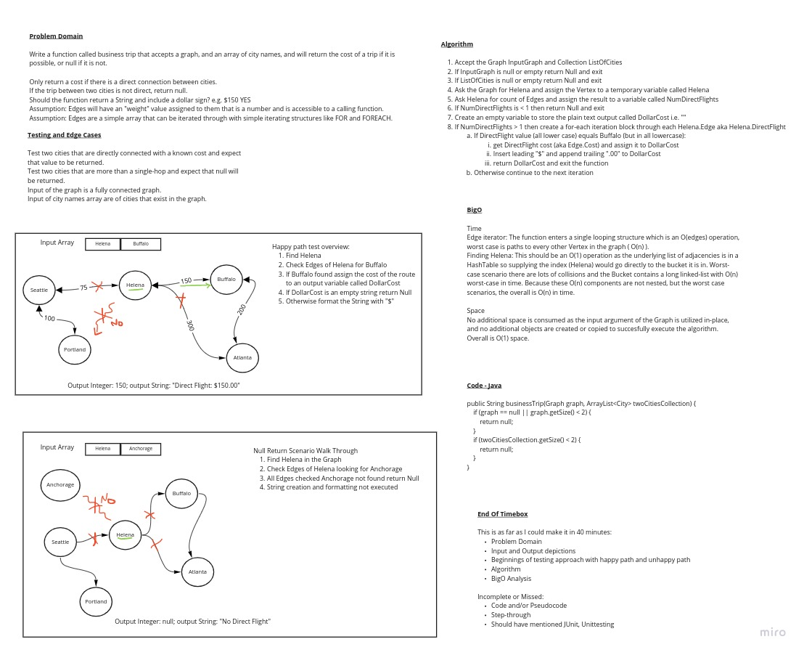

# Breadth Traverse a Graphs

## Challenge

Determine if a direct flight is possible between two cities and return the cost of the direct flight.

## Features

- [ ] Write a function called businessTrip.
- [ ] Method takes a graph and an array of city names as input.
- [ ] Method returns null if direct flight not available, or the cost of the flight if it is available.
- [ ] Implement solution using "clean, reusable, abstract component parts".
- [ ] Write at least 3 test cases (unittests) for each method created.
- [ ] Ensure tests are passing (Two unittests not pass until I implement UNDIRECTED edges (Graph is currently DIRECTED)).
- [ ] Plan implementation by drawing a whiteboard to model and analyze the problem domain prior to implementation.

## Whiteboard

## Structure and Testing

Utilize the Single-responsibility principle: any methods you write should be clean, reusable, abstract component parts to the whole challenge. You will be given feedback and marked down if you attempt to define a large, complex algorithm in one function definition.

Be sure to follow your language/frameworks standard naming conventions (e.g. C# uses PascalCasing for all method and class names).

Any exceptions or errors that come from your code should be contextual, descriptive, capture-able errors. For example, rather than a default error thrown by your language, your code should raise/throw a custom error that describes what went wrong in calling the methods you wrote for this lab.

Tests:

- [ ] An empty graph returns null.
- [ ] An empty array of cities returns null.
- [ ] An array of one city returns null (you don't really want to purchase a circular flight, do you?).

...

## Approach & Efficiency
<!-- What approach did you take? Why? What is the Big O space/time for this approach? -->

The Graph utilizes built-in Java classes TrackingQueue<E> and ArrayList<T> to ensure bug-free operation in those structures.

### Big O: Time

This algorithm operational efficiency is O(n) in time.

Explanation:

The businessTrip() function implements a single looping structure which is an O(edges) efficiency, meaning the most
time will be taken by the Vertex that has edges to every-other Vertex in the Graph, which would boil-down to O(n).

The other possible inefficiency would be in the adjacency list. Although the HashMap uses an O(1) algorithm to index in
to the adjacency list to find the value/object. For a HashMap adjacency list that has lots of collisions, efficiency
will drop as the Bucket Sizes to something approaching O(n) for the max number in any Bucket (assuming linked lists).

### Bit O: Space

This algorithm operational efficiency is O(1) in space.

Explanation:

No additional storage is created, and storage is not duplicated within the method. The input graph is utilized in-
place while executing the algorithm.

## API
<!-- Description of each method publicly available in your Graph -->

This Graph's businessTrip() method accepts a Graph of size N and an array of 2 cities possibly within the graph that
may or may not be connected by a single edge.

To use this method:

1. Instantiate a new instance of the Graph class.
2. Create a graph with Vertices containing city names as values and edges with values (weights) representing cost of each edge as a "flight".
3. Create a Collection i.e. ArrayList<City> that has 2 city names (Strings) within it.
4. Call graph.businessTrip(Graph, Collection) and include the Graph created above, and Collection created above.
5. Capture the result as a String.
6. If the String is null, there was no direct flight between the cities, or cities were not found, or graph was empty.
7. String returned with value will be like (for example) "$150.00"
