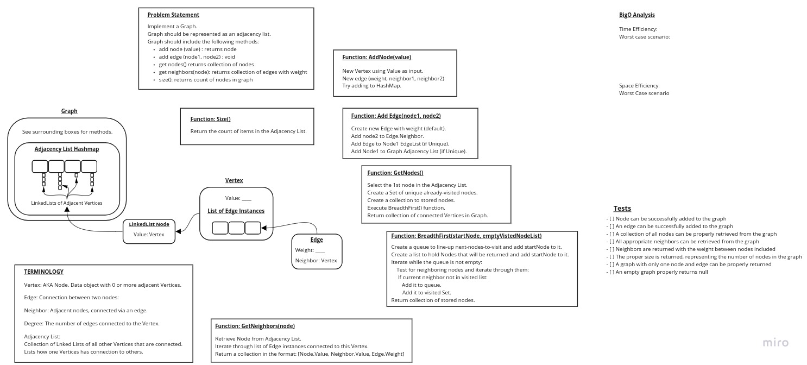

# Graphs

## Challenge

Graphs are similar to trees and linked lists in that there are nodes that store data and references to other nodes in a data structure.

## Features

- [X] Graph should be represented as an adjacency list.
- [X] Add node method. Arguments: value. Returns: The added node. Adds a node to the graph.
- [X] Add edge method. Arguments: 2 nodes to be connected by the edge, weight (optional). Returns: nothing. Adds a new edge between two nodes in the graph. If specified, assign a weight to the edge. Both nodes should already be in the Graph.
- [X] Get nodes method. Arguments: none. Returns all nodes in the graph as a collection (set, list, or similar).
- [X] Get neighbors method. Arguments: node. Returns a collection of edges connected to the given node. Include the weight of the connection in the returned collection.
- [X] Size method. Arguments: none. Returns the total number of nodes in the graph.
- [ ] Implement descriptive error handling.

## Whiteboard

## Structure and Testing

Utilize the Single-responsibility principle: any methods you write should be clean, reusable, abstract component parts to the whole challenge. You will be given feedback and marked down if you attempt to define a large, complex algorithm in one function definition.

Be sure to follow your language/frameworks standard naming conventions (e.g. C# uses PascalCasing for all method and class names).

Any exceptions or errors that come from your code should be contextual, descriptive, capture-able errors. For example, rather than a default error thrown by your language, your code should raise/throw a custom error that describes what went wrong in calling the methods you wrote for this lab.

Tests:

- [ ] Node can be successfully added to the graph
- [ ] An edge can be successfully added to the graph
- [ ] A collection of all nodes can be properly retrieved from the graph
- [ ] All appropriate neighbors can be retrieved from the graph
- [ ] Neighbors are returned with the weight between nodes included
- [ ] The proper size is returned, representing the number of nodes in the graph
- [ ] A graph with only one node and edge can be properly returned
- [X] An empty graph properly returns null

## Approach & Efficiency
<!-- What approach did you take? Why? What is the Big O space/time for this approach? -->

Encapsulate as much state and functionality into Vertex and Edge classes to promote short, simple methods to do the work.

Employ a Breadth First traversing algorithm to gather nodes while tracking 'visited' nodes so a definitive list could be returned.

Leverage Java's built-in HashMap class to simplify storing the Adjacency List.

Utilize Generics to allow various data types, although there is still the limitations set on Vertex and Edge classes (despite their also being Generic).

### Big O: Time

The Java 8 documentation asserts their HashMap implementation is worst-case O(n) accessing stored items, although that is an average estimation.

Worst case scenario, the hashmap is too small for the data inputs, and the load factor is set poorly, so re-hash episodes are triggered, causing much worse performance until a good balance is found.

Beyond the built-in HashMap class, this implementation has no iterators within the Edge or Vertex classes, so their worst-case performance is O(1) for all operations.

For the Graph Class:

- addEdge(): Has an iterator thus could be an O(n) worst-case, depending on the number of edges "node1" already has.
- getNodes(): This is an O(1) operation, although utilizing it implies that breadthFirst() will be called (see below).
- breadthFirst(): This method utilizes nested iterators: One operates while a Queue structure is not empty, and the other operates when the Node under inspection has 1 or more edges. This could lead to an O(n^2) performance in worst-case scenarios.
- getNeighbors(): It sounds like this method could use an iterator but it does not. It simply returns the existing Collection of Neighbor Vertices held in the current Vertex's Edge collection. O(1).
- All other methods are O(1).

Overall worst-case scenario is O(n^2) due to nested iterators.

### Bit O: Space

For the most part, the worst-case scenario is calling getNodes() method on a very large Graph. This could take up at least O(1) and possibly O(n) space depending on uniqueness across the Graph.

Overall worse-case is O(n).

## API
<!-- Description of each method publicly available in your Graph -->

Coming soon!
