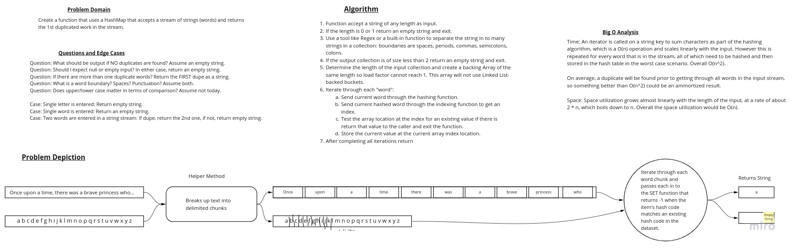

# Hashmap Repeated Word

## Feature Tasks

Write a function called repeated word that finds the first word to occur more than once in a string

Arguments: string

Return: string

## Structure and Testing

Utilize the Single-responsibility principle: any methods you write should be clean, reusable, abstract component parts
to the whole challenge. You will be given feedback and marked down if you attempt to define a large, complex algorithm
in one function definition.

Write at least three test assertions for each method that you define.

Ensure your tests are passing before you submit your solution.

## Stretch Goals

- [ ] Modify your function to return a count of each of the words in the provided string

- [ ] Modify your function to return a list of the words most frequently used in the provided string

## Whiteboard Process

## Approach and Efficiency

Approach:

Implement a Hash Table with a hashing function and Chaining using Linked Lists that will store items and simplify
discovering when an item is a duplicate.

Leverage String functions and a RegEx to split the input stream into separate "words" between non-word characters.

Initialize the array with null-valued Linked Lists, one in each bucket, to avoid thrown Exceptions and to enable
hash collisions between different words/inputs.

Implement a simple hashing algorithm that will multiply the Char values of each character in each word and use modulus
to ensure the resulting index is bound to the size of the underlying storage array.

Short-circuit to returning a result as quickly as possible in all cases where it is appropriate to do so.

Time Efficiency:

An iterator is called on a string key to sum characters as part of the hashing algorithm, an O(n) operation.
This iterator is called once for every word in the input stream which points to an overall O(n^2). Searching for a
duplicate value requires traversing the Bucket's linked list, which in a worst-case scenario is an O(n) operation,
and that occurs whenever there is a collision which in the worst case scenario would happen with a very large input
data set.

Since the method exits as soon as a duplicate is found, the short-circuit effect will be reduced in the average
scenario. Still, the worst-case scenario boils-down to a significant O(n^2) performance in time.

Space Efficiency:

Space utilization grows exponentially at first, as an array is initialized and Linked Lists are created to match the
size of the input stream. This results in O(n^2) space utilization. After this initialization, there is a 1/k chance
that a Linked List will add a node (which is an O(n) operation until the load factor is about 1. After that every
added item will result in an O(n) add to the linked list, but the increase is still linear.

Boiling this down to the most significant denominator in a worst-case scenario, overall space efficiency is O(n^2).

## Solution

Link to [Code](../../lib/src/main/java/simpleStringHashTable/SimpleStringHashTable.java)

Link to [Tests](../../lib/src/test/java/simpleStringHashTable/SimpleStringHashTableTests.java)
