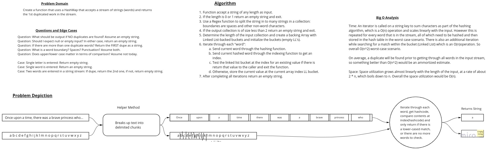

# Hashmap Repeated Word

## Feature Tasks

Write a function called repeated word that finds the first word to occur more than once in a string

Arguments: string

Return: string

## Structure and Testing

Utilize the Single-responsibility principle: any methods you write should be clean, reusable, abstract component parts
to the whole challenge. You will be given feedback and marked down if you attempt to define a large, complex algorithm
in one function definition.

Write at least three test assertions for each method that you define.

Ensure your tests are passing before you submit your solution.

## Stretch Goals

- [ ] Modify your function to return a count of each of the words in the provided string

- [ ] Modify your function to return a list of the words most frequently used in the provided string

## Whiteboard Process

## Approach and Efficiency

Approach:

Ensure the size of the underlying array is such that collisions are unlikely *except for instances where the words are
indeed duplicates*, in which case detection of duplicate words in a stream will be easy. A load factor calculation is
implemented to verify it is less than 1 even when duplicates are found.

Leverage String functions and a RegEx to split the input stream into separate "words" between non-word characters.

Implement a simple hashing algorithm that will sum the Char values of each character in each word and use modulus
to ensure the resulting index is bound to the size of the underlying storage array.

Short-circuit to returning a result as quickly as possible in all cases where it is appropriate to do so.

Time Effeciency:

An iterator is called on a string key to sum characters as part of the hashing algorithm, an O(n) operation.
This iterator is called once for every word in the input stream which points to an overall O(n^2).
Since the method exits as soon as a duplicate is found, the short-circuit effect will be reduced in the average
scenario. Worst-case scenario however, will ben an O(n^2) performance in time.

Space Effeciency:

Space utilization grows almost linearly with the length of the input at a rate of about 2 * n.
Since 2n boils down to n, the overall space utilization would be O(n).

## Solution

Link to [Code](../../lib/src/main/java/simpleStringHashTable/SimpleStringHashTable.java)

Link to [Tests](../../lib/src/test/java/simpleStringHashTable/SimpleStringHashTableTests.java)
