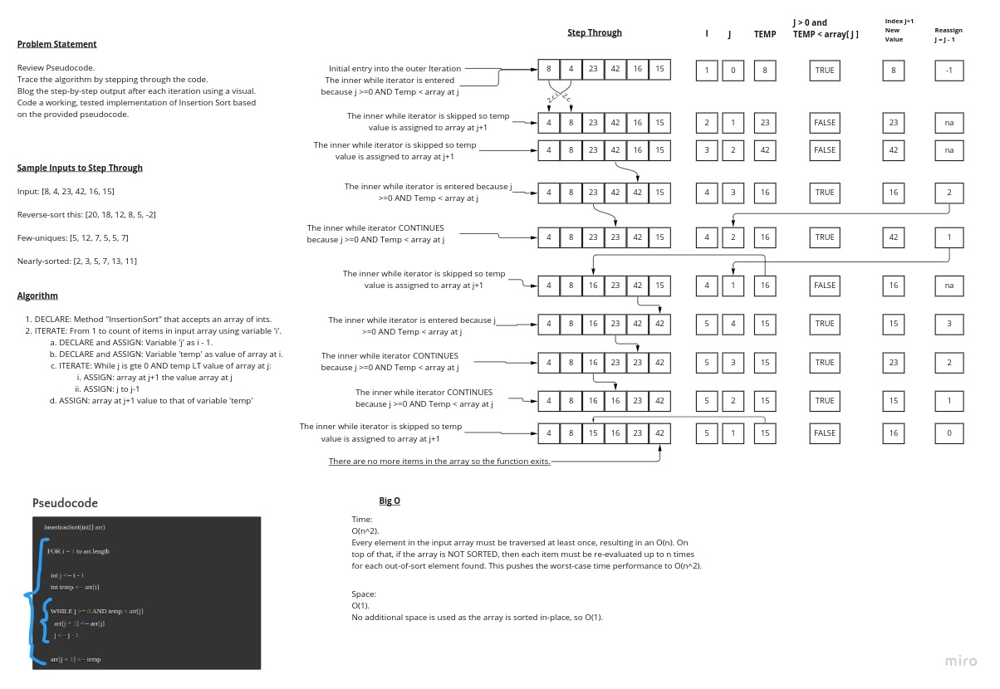

# Insertion Sort

## Summary

Starting with the supplied pseudocode, generate a whiteboard walking through the code given the supplied inputs, then
write code and full range of tests.

## Whiteboard Process
<!-- Embedded whiteboard image -->

## Approach & Efficiency
<!-- What approach did you take? Why? What is the Big O space/time for this approach? -->

Time: O(n^2)

Space: O(1)

## Solution
<!-- Show how to run your code, and examples of it in action -->

## Tests

Happy Path

Expected Failure

Edge Case

## Status Report

- [ ] Top-level README “Table of Contents” is updated
- [ ] README for this challenge is complete
  - [ ] Summary, Description, Approach & Efficiency, Solution
  - [ ] Picture of whiteboard
  - [ ] Link to code
- [ ] Feature tasks for this challenge are completed
- [ ] Unit tests written and passing
  - [ ] “Happy Path” - Expected outcome
  - [ ] Expected failure
  - [ ] Edge Case (if applicable/obvious)

