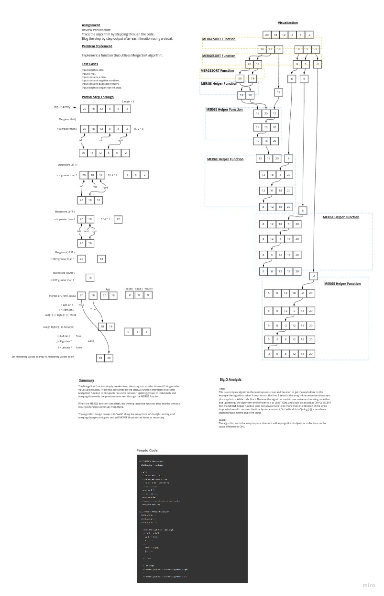

# Merge Sort

The Merge-sort code challenge presents pseudocode of a merge sort algorithm.

Goal is to prepare a whiteboard for presentation.

## Whiteboard Process
<!-- Embedded whiteboard image -->

## Approach & Efficiency
<!-- What approach did you take? Why? What is the Big O space/time for this approach? -->

The Pseudocode was provided and the task was to analyze it and work through whiteboarding the problem with the help of the pseudocode.

A step-through of execution through the first MergeSort helper method execution is provided as a starter to understand algorithm behavior.

A depiction of the *results* of each step with indicators of which function is doing what is provided for a better picture of the complete operations over an entire 6-element array.

The basic approach is:

- Bisect the array, and each resulting array is bisected again using a recursive method.
- When a single unit is reached, a comparison is performed between the left and right individual cells and they are effectively swapped if necessary.
- If there are further cells to the left, they are compared to the right cell and swapping continues to index 0.
- Once the final index is merged with the left array (all other sorted and merged indices values), it is also sorted and merged in.
- The helper exits again and the MergeSort algorithm has no more new work to perform so it exits.

Analysis:

- The array is sorted *in place*.
- The recursive function calls a While iterator.
- No additional storage is utilized as there are less than n variables stored during processing.

Big-O Analysis TIME: O(n log(n))

- A recursive function calls a While iterator, however the While iteration might not execute more than once.
- The efficiency is somewhere between O(n^2) due to nested recursion and iterator and O(n) due to fast-exiting one a pair of values are compared.
- Overall the time is a slightly increasing rise in time to compute at larger and worse-case inputs.

Big-O Analysis SPACE: O(n)

No additional storage is utilized so the storage is constant, therefore efficiency is O(n).

## Solution
<!-- Show how to run your code, and examples of it in action -->

*Does Not Apply* to this Code Challenge.
