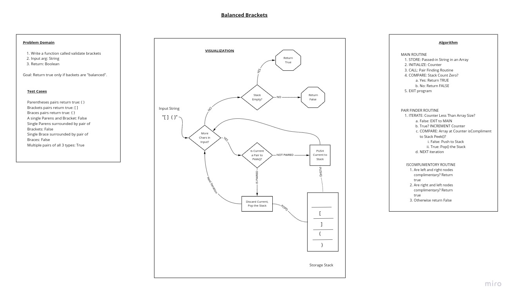

# Challenge Summary

Write a function that validates whether an input String has "balanced brackets".

If the input string "brackets" do not all have compliments, return False.

If all bracket types are "paired" then return True.

Use a Stack and/or a Queue to accomplish the functionality.

## Whiteboard Process

## Approach

Test for bad inputs and strip-away any non-bracket-like characters (including only brackets, braces, and parens).

Cycle through the input and push 1st-time-seen bracket-like characters into a storage Stack.

Test subsequent characters for "complimentary" characters at the top of the Stack, and pop the Stack once if a compliment is found.

Manage a count of items encountered so the processing stops by the end of the input array.

Test whether the stack is empty and if so, whether the input had brackets (of the 3 types) at all, and return true only if both of those tests return true, otherwise return false and exit the algorithm.

## Efficiency

### Time

The Balanced Bracket Class utilizes RegEx and an Iterating structure to sift through the String input.

As there are more bracket-types in the input, code execution grows.

However, non-bracket-type input characters are stripped from the processing early using a RegEx (assume that is an iterator) so assume a decreasing time efficiency with larger inputs.

Processing bracket pairs processes O(1) lines of code within a While structure, resulting in an O(n) in time.

The actual comparison of complimentary pairs is performed twice for nearly every bracket-type input character, from within the previous While structure, resulting in an O(n^2) in time.

Therefore, the Time efficiency will be O(n^2), even when lots of non-bracket-type inputs are included.

### Space

The BalancedBrackets class stores some local variables including static Strings that never change.

With a large valid input, the inputCharacters array will grow to a size of *bracket-like inputs*.

In processing the storage stack will grow and shrink, utilizing less than O(1) space in even the worst-case scenario (it doesn't store every input).

Therefore, the Space efficiency will be no worse than O(1).

## Solution

Utilize a Stack to "trap" unique Characters as they come in from the input String "stream".

Compare the next Character to the "Peek" value of the Stack (aka "Top") and if there is a match then just remove them, otherwise ADD the lonely item to the Stack.

Once all String inputs have been checked and if the stack is EMPTY then all Characters would have been "paired" so return true, otherwise return "false" as there must be one or more "unpaired" or "missing compliments" characters in the stream.

An empty input returns False by default.

## Link to Code

Code for this challenge is [in this repo](../../lib/src/main/java/stack/and/queue/BalancedBrackets.java)

## Test Cases

Planned unit tests:

- [X] Pairs of parentheses return true.
- [X] Brackets pairs returns true.
- [X] Braces pairs returns true.
- [X] Single parenthesis returns false.
- [X] Single parenthesis surrounded by pair of brackets returns false.
- [X] Single brace surrounded by pair of braces returns false.
- [X] Multiple pairs of brackets, braces, and parens returns true.
- [X] Empty input returns false.
- [X] Input lacking any parens, braces, and brackets returns false.
- [X] Mixed input types with unmatched pairs returns false.
- [X] Other input types with matched pairs returns true.

[Balanced Brackets Test Suite](../../lib/src/test/java/stack/and/queue/TestBalancedBrackets.java)

## Footer

Return to [Read Me](../../README.md)

Return to [Root Read Me](../../../../README.md)
