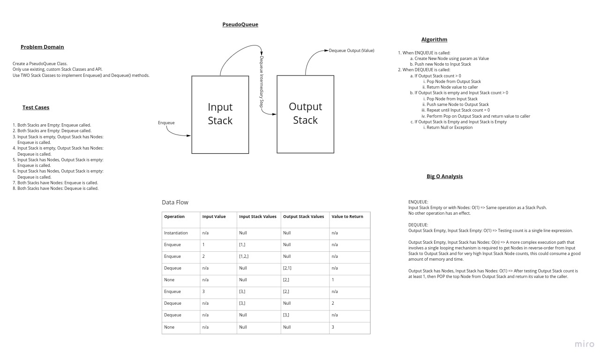

# Pseudo Queue

## How to Use

1. Install a Java JDK at version 17.x or higher
2. Install Gradle w/ JUnit Jupiter support
3. Clone this repo
4. CD to 'stack-and-queue' directory
5. To build: `./gradlew build` and review the output
6. To execute tests suite: `./gradlew test` and review the output

At this point you can import the packages 'MyStack' and 'MyQueue' by pointing to the main directory in this project.

## Tools and Technologies

- Temurin Java JDK v17.x
- Gradle
- JUnit Jupiter test framework
- IntelliJ IDEA
- Linux (to mirror dev environment)

### Bonus Feature

Java Generics.

## Approach and Efficiency

The problem domain pointed out that 2 Stack Classes must be used to implement Enqueue and Dequeue.

This could be seen literally as "use a Stack for Enqueue operations, another for Dequeue operations".

Using an Input Stack and Output Stack enables the following:

- All inputs are single-step operations, same as they are for a regular Stack Push() method call.
- All output are single-step operations assuming the Output Stack has values stored in it.

The challenge comes when the Output Stack is empty and Dequeue method is called.

If the Input Stack is also empty, which is a single-call test, then nothing need be done nor returned (perhaps an Exception?)

If the Input Stack has values (Nodes) then an iterating structure is necessary to POP from Input the PUSH to Output, one-by-one, until the Input Stack is empty.

Only after the Input Stack has been emptied can the Output Stack be asked to POP a Node in order to return the propertly "Dequeued" value.

## Design

## BigO Analysis

This was done in the Design drawing, but I will summarize here:

Enqueue(value): When input stack is empty or with nodes => O(1) operation as no iterators are necessary, and just a single New Node is created.

Dequeue(): When both Input and Output stacks are empty => O(1) as a test of the Count property is all that is necessary.

Dequeue(): When both Input and Output stacks HAVE NODES => O(1) because the Output Stack needs to be POPped just once and the Node value returned to the caller.

Dequeue(): When *only Input Stack* has Nodes => O(n) because multiple operations must be executed, including a single-level iterator to move all nodes from Input Stack to Output Stack *prior to* POPping the Output Stack and returning the Node value to the caller.

Peek(): TBD O(tbd).

## API

boolean Enqueue(T value): Creates a New Node using the value param and a PUSH is performed into the Input Stack.

T Dequeue(): Returns a T value in multiple scenarios, however will return Null (or Exception) if there are no values in the PseudoQueue at all.

T Peek(): Returns the Front T value without removing it from the Queue.

## Members

public Stack<T> InputStack: The 1st Stack used for ENQUEUE operations.

public Stack<T> OutputStack: The 2nd Stack leveraged when managing DEQUEUE operations.

public CTOR: Initialize InputStack and Output Stack.

public boolean Enqueue(T value): Adds a value at the Rear of the PseudoQueue. Calls Push(value) on inputStack.

public T Dequeue(): Returns value at Front of PseudoQueue and removes it from the Queue. If there are no items in the output Stack, calls stackShift before removing Front item.

public T Peek(): Returns T value from Front of PseudoQueue without removing it. If there are no items in the output Stack, calls stackShift before returning the *value* of the Front item.

public count: The total number of values (Nodes) being held in this PseudoQueue, as a sum of internal Stacks inputStack and outputStack.

private boolean stackShift(): Moves items from inputStack to outputStack.

## Tests

- [X] Instantiating a new Queue does not throw.
- [X] Calling Dequeue() on an empty PseudoQueue returns Null.
- [X] Calling Enqueue() on an empty PseudoQueue increments the PseudoQueue count.
- [X] Calling Enqueue() multiple times, then calling Dequeue() once, then calling Enqueue() once correctly alters the PseuduQueue count.
- [X] Calling Enqueue() multiple times, then calling Dequeue() multiple times, then calling Enqueue() once correctly increments PseudoQueue count.
- [X] Calling Enqueue() multiple times to load many values, then calling Dequeue() multiple times returns values in correct FIFO order.
- [X] Calling Peek() on an empty PseudoQueue returns Null.
- [X] Calling Peek() on a non-empty PseudoQueue returns the front value but does not decrement the counter.
- [X] Calling Enqueue() to load many values, then calling Peek() once returns FIFO Front value, then calling Enqueue() to load more values, followed by calling Dequeue() causes all values to be returned in FIFO order.

- Link to [Pseudo Queue Tests](../../lib/src/test/java/stack/and/queue/TestPseudoQueue.java)

## Link to code

Code for this challenge can be found in [this repo](../../datastructures/lib/src/main/java/stack/and/queue/PseudoQueue.java)

## Footer

Return to [READ ME](../../README.md)

Return to [Root READ ME](../../../../README.md);
