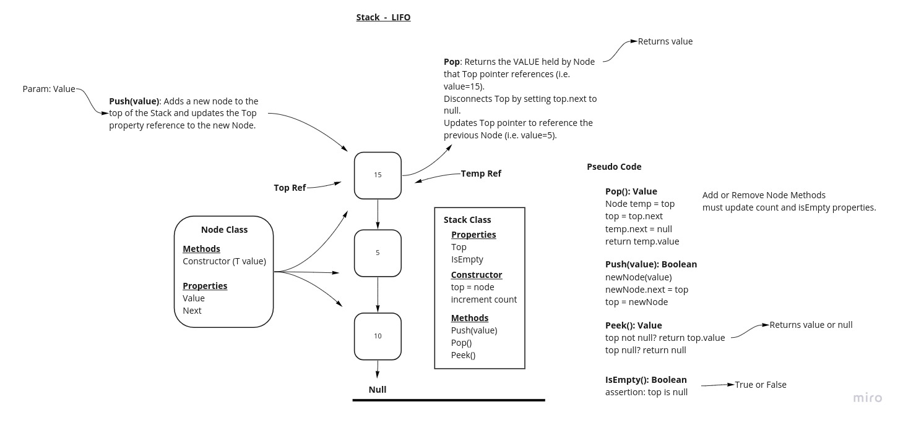
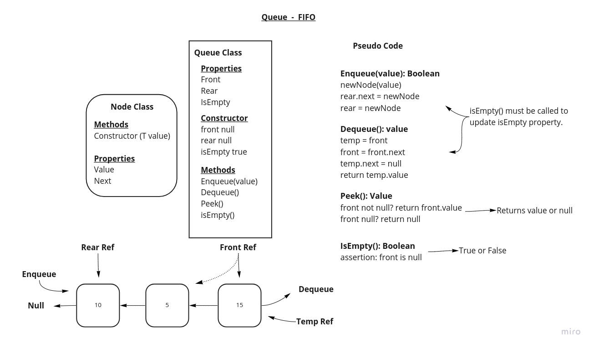

# Stacks and Queues

Understanding how to build and use Stacks and Queues is essential knowledge for a software engineer.

## How to Use

1. Install a Java JDK at version 17.x or higher
2. Install Gradle w/ JUnit Jupiter support
3. Clone this repo
4. CD to 'stack-and-queue' directory
5. To build: `./gradlew build` and review the output
6. To execute tests suite: `./gradlew test` and review the output

At this point you can import the packages 'MyStack' and 'MyQueue' by pointing to the main directory in this project

## Tools and Technologies

- Temurin Java JDK v17.x
- Gradle
- JUnit Jupiter test framework
- IntelliJ IDEA
- Linux
- Miro (for technical planning documentation)
- Java "Generics"

## Challenge Pseudo Queue

Implement a PseudoQueue class that uses two MyStack class objects to implement the Queue API.

See the sibling readme file [PseudoQueueREADME.md](./PseudoQueueREADME.html)

## Challenge Stack And Queue

Implement both a stack and a Queue using lessons learned from creating and using Linked Lists.

The remainder of this readme will focus on Stack-and-Queue challenge documentation.

## Approach and Efficiency

A design document was created prior to writing any code.

Big O analysis was used to keep space and time estimates linear or better in worst-case scenarios.

Whenever possible additional properties and Get/Setters were created to manage List Size and exception throwing situations in graceful ways.

Generics were implemented to allow the caller to use any Type or customer Class as their custom Node payload.

### Design

MyStack Class Design Document:

-- -

MyQueue Class Design Document:

### Big O Analysis

All Stack methods are O(1) operation because no iterations or recursive functions are used.

## API

Methods and their short descriptions

### Stack

Constructor: Only necessary to instantiate a Stack, and requires a value with a user-defined Type T.

Push: Accepts a value type T, creates a new Node of type T, adds it to top of the existing stack instance.

Pop: Creates temporary Node and moves head pointer to previous Node, then returns temp Node value to the caller.

Peek: Returns the value of the 'top' Node in the Stack, or null if the Stack is empty.

IsEmpty(): Getter/Setter function to A) Return true if the Stack is empty, and B) Stack functions can call this method to update the hidden isEmpty property, for internal use.

### Queue

Constructor: Only necessary to instantiate a new Queue. Does not require a value.

Enqueue: Accepts a value type T, creates a new Node of type T, and adds it to the 'end' of the existing Queue instance.

Dequeue: Returns a value type T as was stored in a Node now at the 'front' of the existing Queue instance.

Peek: Returns the value of the 'front' Node in the existing Queue, or null if the Queue is empty.

IsEmpty(): Getter/Setter function to A) Return true if the Queue is empty, and B) Queue functions can call this method to update the hidden isEmpty property, for internal use.

## Tests

### STACK Tests

[X] Can successfully push onto a stack

[X] Can successfully push multiple values onto a stack

[X] Can successfully pop off the stack

[X] Can successfully empty a stack after multiple pops

[X] Can successfully peek the next item on the stack

[X] Can successfully instantiate an empty stack

[P] Calling pop or peek on empty stack raises exception

*Note*: Calling peek() will return *null* instead of an Exception.

### QUEUE Tests

[X] Can successfully enqueue into a queue

[X] Can successfully enqueue multiple values into a queue

[X] Can successfully dequeue out of a queue the expected value

[X] Can successfully peek into a queue, seeing the expected value

[X] Can successfully empty a queue after multiple dequeues

[X] Can successfully instantiate an empty queue

[P] Calling dequeue or peek on empty queue raises exception

*Note*: Calling peek() will return *null* instead of an Exception.
