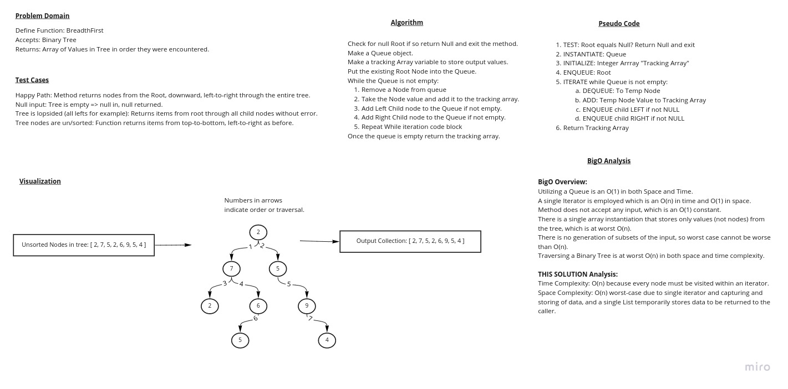

# Code Challenge Tree Breadth First

Write a function called 'breadthFirst'.

Function accepts an argument of a (Binary) Tree.

Function returns a list of all values in the tree, in the order they were encountered.

## Whiteboard Process

## Approach & Efficiency

BigO Time: O(n)

BigO Space: O(n)

Please review the Whiteboard Process (above) for detailed explanations.

## Solution

How to run code:

1. Clone the repo to your local.
2. Install Gradle v.4 or grater.
3. Execute `./gradlew test`.
4. Open your IDE and traverse to the test files located in [BinarySearchTreeFindMax code](lib/src/test/java/BinarySearchTreeFindMax) and run the tests.

Example in action:

The best views into how this code works are the Whiteboard Process image (above) and by executing tests in debug mode, stepping through the code blocks.

Implementation code for this challenge can be found in [binaryTreeFindMax package directory](java/datastructures/lib/src/main/java/binaryTreeFindMax)

## Tests

Tests for this code challenge are in [BinaryTreeFindMaxPackageTests](java/datastructures/lib/src/test/java/binaryTreeFindMax/BinaryTreeFindMaxPackageTests.java)

## Project Status

- [X] Top-level README “Table of Contents” is updated
- [X] README for this challenge is complete
  - [X] Summary, Description, Approach & Efficiency, Solution
  - [X] Picture of whiteboard
  - [X] Link to code
- [X] Feature tasks for this challenge are completed
- [X] Unit tests written and passing
  - [X] “Happy Path” - Expected outcome
  - [X] Expected failure
  - [X] Edge Case (if applicable/obvious)
