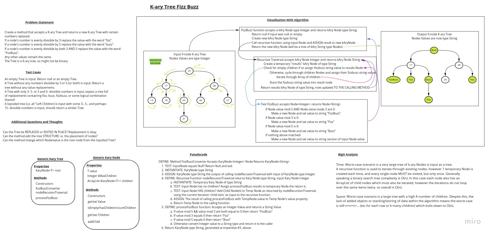

# Tree Fizz-Buzz Code Challenge

Write a function called fizz buzz tree that accepts a k-ary tree and returns a new k-ary tree with Fizz-Buzz updates.

## Requirements

- Write a function called fizz buzz tree
- Arguments: k-ary tree
- Return: new k-ary tree
- If the value is divisible by 3, replace the value with “Fizz”
- If the value is divisible by 5, replace the value with “Buzz”
- If the value is divisible by 3 and 5, replace the value with “FizzBuzz”
- If the value is not divisible by 3 or 5, simply turn the number into a String.

## Feature Tasks

*Note* This revision of the solution is broken. I failed to account for changing the Type from Integer (assumed)
to String. I will have to revisit the whiteboard, update it, then TDD and resubmit at a later date.

- [X] Top-level README “Table of Contents” is updated
- [X] README for this challenge is complete
- [ ] Summary, Description, Approach & Efficiency, Solution
- [X] Picture of whiteboard
- [X] Link to code
- [ ] Feature tasks for this challenge are completed
- [X] Unit tests written and passing
- [ ] “Happy Path” - Expected outcome
- [ ] Expected failure
- [ ] Edge Case (if applicable/obvious)

## Whiteboard Process

## Approach & Efficiency

Initial approach was to:

- Use BFS traversal through the nodes and at each *dequeue* check for fizz/buzz/fizzbuzz.
- If fizz or buzz or fizzbuzz detected, simply replace the Value in the generic node.

## Solution

*Note*: It will not possible to simply remove the *value*, I will have to refactor to create a *new node* of the
correct T (String in these cases) and re-wire the parent and children nodes. The whiteboard design shows some
of the logic (a helper function) but that has not been implemented in code.

## Code

The implementation ~~can~~ will be found in directory [java/datastructures/lib/src/main/java/karyTree](java/datastructures/lib/src/main/java/karyTree)

## Unit Tests

- [ ] Happy Path
- [ ] Edge Case(s)
- [ ] Failure Case(s)

You can find the tests in this Java class file [java/datastructures/lib/src/test/java/karyTree/karyTreePackageTests.java](java/datastructures/lib/src/test/java/karyTree/karyTreePackageTests.java)
