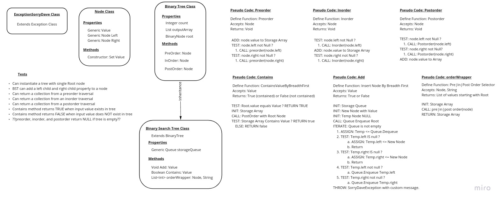

# Trees

Code Challenge: Design and code a Binary Tree and implement Binary Search Tree algorithms.

## Trees Challenge Requirements

This will be a new implementation.

-[X] Create a Node class that has properties to store a Value, left child Node, and right child Node.

-[X] Create a Binary Tree Class.

-[X] Define a PreOrder depth-first traversal method.

-[X] Define an InOrder depth-first traversal method.

-[X] Define a PostOrder depth-first traversal method.

-[X] Exceptions and errors that come from my code should be *Custom Exceptions*, named semantically and capture-able by other calling methods.

-[X] Create a Binary Search Tree class (BST).

-[X] BST should be sub-class of Binary Tree Class, adding a few of its own methods (next goal).

-[X] BST Add method: Takes a value, returns nothing, and adds a new node with that value in the correct location in the BST.

-[X] BST Contains: Takes a value, and returns a boolean: True if value is in BST, False otherwise.

## Structure and Testing

-[X] All methods should follow single-responsibility principal.

-[X] All methods should be reusable, abstract component parts.

-[ ] Can successfully instantiate an empty tree.

-[ ] Can successfully instantiate a tree with a single root node.

-[ ] For a Binary Search Tree, can successfully add a left child and right child properly to a node.

-[ ] Can successfully return a collection from a preorder traversal.

-[ ] Can successfully return a collection from an inorder traversal.

-[ ] Can successfully return a collection from a postorder traversal.

-[ ] Contains Method verifies it returns True when value exists in a Node, False if not (2 tests).

## Trees Approach & Efficiency

Ideally, a BST will have a Time Complexity of O(log(n)) with a worst of O(n) in an unbalanced Tree, and a Space Complexity of O(n).

- Searching: O(h) where h is the Height of the tree (or log(total_nodes)).
- Inserting: O(h) because in worst-case scenario, it is the same a searching.

Space Complexity of Search: O(1) because no significant memory is allocated.

### Design Whiteboard

###Trees API

- Instantiate a Binary Search Tree Class without a Root: `binarySearchTree bst = new BinarySerachTree()`

- Instantiate a BST with a root containing value integer 11: `binarySearchTree bst = new BinarySerachTree(11)`

- Add a Node with value integer 25 to the Binary Tree: `bst.Add(25)`

- Discover if the Binary Tree contains a value 25: `bst.Contains(25)` returns True if so, otherwise False.

- Find out if the Binary Tree is empy or not: `bst.getIsEmpty()` returns True if empty, otherwise false.

## ISSUES

None at the time this was written.

-- -

## Link to Code

Code can be found [in this repo](../../datastructures/lib/src/main/java/binarySearchTree)
