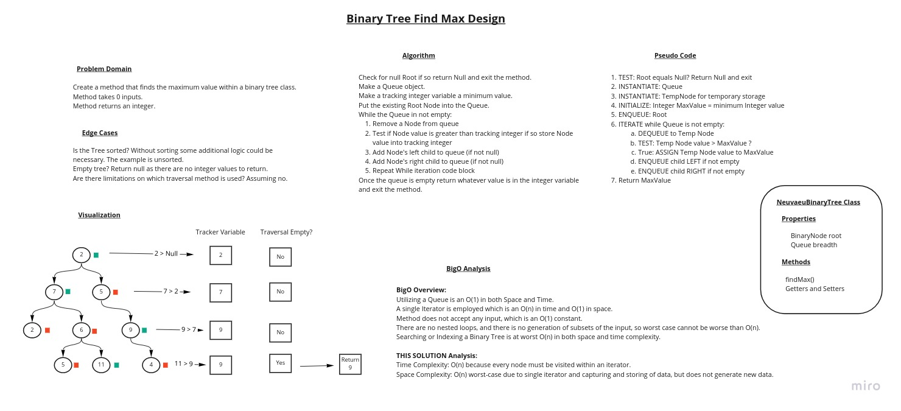

# Code Challenge TreeMax

Find the max value within a Tree using BST algorithms.

## Feature Tasks

- [X] Create a method that finds the maximum integer value within a Binary Tree Class.
- [X] Input arguments: None
- [X] Return: Integer

## Requirements

- [X] Write Unit Tests
- [X] Follow well-formatted README template
- [X] Follow the special assignment submission instructions

## Whiteboard Process

## Approach and Efficiency

### Big O Space and Time Analysis

Time Complexity: O(n) => Every node must be visited within an iterator, and the Queue implementation does not include iterators or operations more complex than O(n).

Space Complexity: O(n) => Worst-case scenario due to single-iterator and capturing and storing some data, but no new data is generated.

Reference: [Hackerearth.com](https://www.hackerearth.com/practice/notes/big-o-cheatsheet-series-data-structures-and-algorithms-with-thier-complexities-1/)

## Solution

Implement a Breadth-First Search method utilizing a Queue so that every Node (and their children) is inspected for a value greater than a tracking value.

If a Node value is greater than the tracking value, the Node value replaces the tracking variable value.

After all nodes have been visited, the tracking value is returned.

If the Binary Tree is sorted, it would not be necessary to visit every single node, however that case is not defined so the algorithm must account for that by checking the entire tree.

### How to run the code

1. Clone the repo to your local.
2. Install Gradle v.4 or grater.
3. Execute `./gradlew test`.
4. Open your IDE and traverse to the test files located in [BinarySearchTreeFindMax code](lib/src/test/java/BinarySearchTreeFindMax) and run the tests.

### Examples of code in action

There is no user interface, so you must develop one if you want to interact with the code, short of using JUnit Jupiter (or similar) testing frameworks.

See the Whiteboard Process for a visual.
