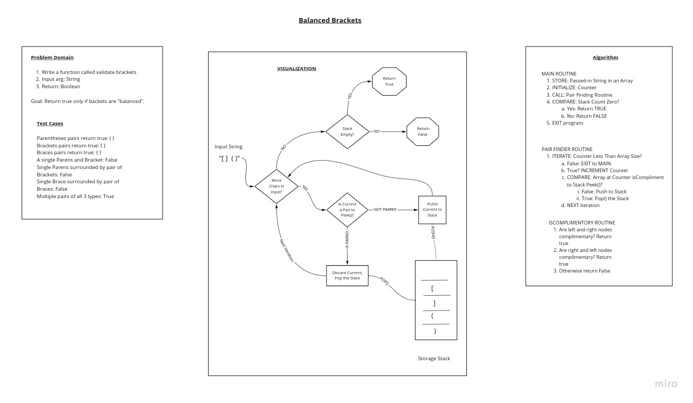

# Challenge Summary

Write a function that validates whether an input String has "balanced brackets".

If the input string "brackets" do not all have compliments, return False.

If all bracket types are "paired" the return True.

Use a Stack and/or a Queue to accomplish the functionality.

## Whiteboard Process

## Approach and Efficiency

The Balanced Bracket Class utilizes an Iterating structure to sift through the String input.

Therefore, the Time BigO will be O(n).

BigO analysis of space utilization is O(n) also due to the Iterating structure.

Every add, remove, and comparison operation are single-line, one-shot executions, however at least 1 of each (if not more) is called per iteration, so the overall BigO analysis will remain O(n).

## Solution

Utilize a Stack to "trap" unique Characters as they come in from the input String "stream".

Compare the next Character to the "Peek" value of the Stack (aka "Top") and if there is a match then just remove them, otherwise ADD the lonely item to the Stack.

Once all of the Strings have been checked and if the stack is EMPTY then all Characters would have been "paired" so return true, otherwise return "false" as there must be one or more "unpaired" or "missing compliments" characters in the stream.

An empty input returns False by default.

Execute a bivvy of tests (see BalancedBracketsTests.java) to ensure the basic functionality requirements are met.

